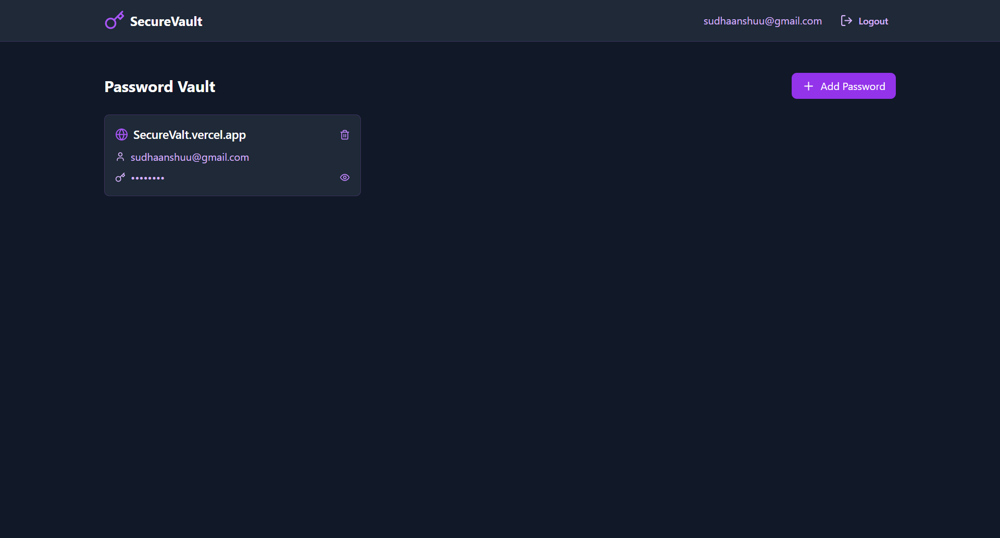

# SecureVault - Modern Password Manager

A modern, secure password manager built with React, TypeScript, and Supabase. Store and manage your passwords with a sleek sci-fi inspired purple and black theme.



## 🚀 Live Website

Visit the live application at: [SecureVault](https://su-pass.vercel.app)

## ✨ Features

- 🔐 Secure password storage
- 👤 User authentication
- 🎨 Modern sci-fi inspired UI
- 👁️ Password visibility toggle
- 📱 Responsive design
- 🔒 Row Level Security with Supabase

## 🛠️ Built With

- React 18
- TypeScript
- Vite
- Tailwind CSS
- Supabase
- Lucide React Icons

## 🚀 Getting Started

### Prerequisites

- Node.js (v18 or higher)
- npm
- Supabase account

### Environment Setup

Create a `.env` file in the root directory with your Supabase credentials:

```env
VITE_SUPABASE_URL=your_supabase_project_url
VITE_SUPABASE_ANON_KEY=your_supabase_anon_key
```

### Installation

1. Clone the repository
```bash
git clone https://github.com/sudhaanshuu/SecureVault.git
cd SecureVault
```

2. Install dependencies
```bash
npm install
```

3. Run security audit (optional)
```bash
npm audit fix
```

4. Start development server
```bash
npm run dev
```

The application will start on `http://localhost:5173`

## 🏗️ Building for Production

```bash
npm run build
```

## 🔧 Database Setup

The application uses Supabase as the backend. The database schema includes:

- `passwords` table with RLS policies
- User authentication
- Secure data access controls

## 👤 Author

**Sudhanshu**
- GitHub: [@sudhaanshuu](https://github.com/sudhaanshuu)

## 🤝 Contributing

1. Fork the Project
2. Create your Feature Branch (`git checkout -b feature/AmazingFeature`)
3. Commit your Changes (`git commit -m 'Add some AmazingFeature'`)
4. Push to the Branch (`git push origin feature/AmazingFeature`)
5. Open a Pull Request

## 📝 License

This project is licensed under the MIT License - see the [LICENSE](LICENSE) file for details.

## 🙏 Acknowledgments

- Supabase for the backend infrastructure
- Vercel for hosting
- Lucide for the beautiful icons

## 🔐 Security

- All passwords are stored securely in Supabase
- Row Level Security ensures data isolation
- User authentication with email and password
- Secure environment variable handling

## ⚠️ Important Notes

1. Never commit your `.env` file
2. Always use HTTPS in production
3. Keep your dependencies updated
4. Run `npm audit` periodically to check for vulnerabilities
